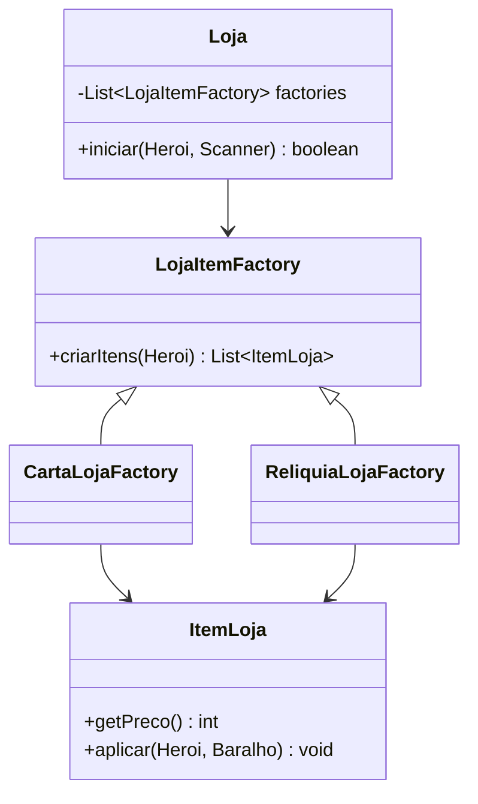
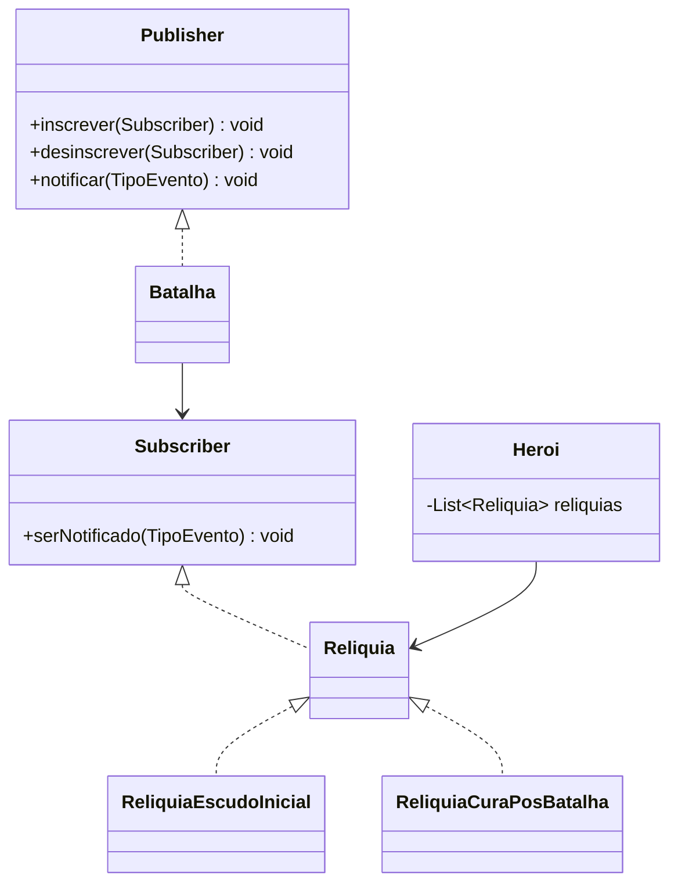

# MC322 — Tarefa 6: Um Jogo Completinho

Projeto desenvolvido para a disciplina **MC322 - Programação Orientada a Objetos** da Unicamp.

Implementação de um sistema de combate por turnos inspirado em *Slay the Spire*, com progressão por um **mapa em árvore** entre batalhas, lojas e escolhas, recompensas pós-combate, relíquias permanentes, sistema de **efeitos acumuláveis** via padrão **Observer** e **testes unitários** com JUnit + JaCoCo.

---

## Compilar e executar

**Compilar:**
```bash
./gradlew build
```

**Executar:**
```bash
./gradlew run --console=plain -q
```

**Rodar os testes:**
```bash
./gradlew test
```

**Relatório de cobertura (JaCoCo):**
```bash
./gradlew test
# Abrir build/reports/jacoco/test/html/index.html no navegador
```

> Os comandos devem ser executados a partir da raiz do repositório.

---

## Progressão pelo mapa

O jogo é organizado como uma **árvore** de nós: cada nó (exceto a raiz) contém um `Evento`. Um evento pode ser uma `Batalha`, uma `Loja` ou uma `Escolha`. O jogador começa na raiz e, após completar o evento atual, escolhe entre os nós filhos não visitados para onde progredir.

```
            Início (raiz)
             /      \
         Floresta  Pântano
           / \      / \
      Caverna Ruínas Torre
         \     |      |
          Loja/Altar  |
              \       |
              Chefe Final
```

- **Vida** e **baralho** do herói **persistem** entre batalhas.
- **Ouro** e **relíquias** também persistem e alteram a progressão.
- **Escudo** e **efeitos de status** são resetados a cada nova batalha.
- O jogo termina em **derrota** se a vida do herói chegar a 0.
- O jogo termina em **vitória** ao concluir um nó marcado como final.

### Eventos

- `Batalha` — combate por turnos. Ao vencer, o herói recebe ouro e pode escolher uma entre 3 cartas aleatórias para adicionar ao baralho, ou pular a escolha.
- `Loja` — permite comprar cartas, comprar relíquias e remover cartas do baralho usando ouro.
- `Escolha` — evento narrativo no terminal com consequências claras: perder vida por carta, ganhar ouro ou recuperar vida.

## Sistemas de progressão da Tarefa 6

### Sistema 1: Loja

A loja é um evento do mapa integrado à progressão entre batalhas. O jogador usa o ouro recebido em batalhas ou escolhas para comprar cartas, comprar relíquias ou remover cartas ruins do baralho.

**Padrão usado:** Factory Method.  
**Fonte consultada:** Refactoring.Guru — <https://refactoring.guru/design-patterns/factory-method>

No código, `LojaItemFactory` define o método de criação de itens, enquanto `CartaLojaFactory` e `ReliquiaLojaFactory` criam ofertas concretas. A classe `Loja` usa essas fábricas sem depender diretamente dos detalhes de criação de cada tipo de item.

Diagrama simplificado:



### Sistema 2: Relíquias

Relíquias são melhorias permanentes carregadas pelo herói entre batalhas. Foram implementadas duas:

- `Broquel Antigo` — concede 4 de escudo no primeiro turno de cada batalha.
- `Anel de Sangue` — cura 3 HP ao vencer uma batalha.

**Padrão usado:** Observer.  
**Fonte consultada:** Refactoring.Guru — <https://refactoring.guru/design-patterns/observer>

As relíquias implementam `Subscriber` por meio da interface `Reliquia`. No início de cada batalha, `Batalha` registra as relíquias do herói como observadoras e dispara eventos como `INICIO_TURNO_JOGADOR` e `VITORIA_BATALHA`.

Diagrama simplificado:



---

## Como jogar

### No menu do mapa
Digite o número do nó adjacente para onde quer avançar.

### Dentro da batalha
A cada turno, escolha quantas cartas comprar (até 5), gaste **3 de energia** por turno e use:

- **Número da carta** — usar a carta da mão
- **-1** — encerrar o turno
- **-2** — descartar uma carta voluntariamente

Após o turno do jogador, cada inimigo executa sua ação.

### Na loja

- **Número do item** — comprar carta ou relíquia
- **-2** — remover uma carta do baralho
- **-1** — sair da loja

---

## Cartas

| Carta | Efeito |
|-------|--------|
| Carta de Dano | Causa dano direto ao inimigo alvo |
| Carta de Escudo | Concede escudo ao herói |
| Carta de Efeito | Aplica Veneno no inimigo ou Regeneração no herói |
| Ataque Venenoso | Dano imediato + acúmulos de Veneno |
| Golpe Duplo | Ataca o inimigo duas vezes na mesma jogada |
| Dreno | Causa dano e cura o herói pelo mesmo valor |
| Extirpar | Remove Veneno do alvo e converte em dano imediato |
| Escudo Regenerativo | Escudo + efeito de Regeneração |

---

## Efeitos

### Veneno
Aplicado ao **inimigo**. No fim de cada turno do jogador, o alvo perde HP igual aos acúmulos, reduzindo 1 acúmulo.

### Regeneração
Aplicada ao **herói**. No fim de cada turno do jogador, cura HP igual aos acúmulos, reduzindo 1.

---

## Padrão Observer

Os efeitos e as relíquias usam o padrão **Observer**:

- **Publisher** — a classe `Batalha` mantém os `Subscriber`s da batalha atual e os notifica nos eventos.
- **Subscriber** — cada `Efeito` ativo e cada `Reliquia` registrada reagem ao evento correto.
- **TipoEvento** — enum: `INICIO_TURNO_JOGADOR`, `FIM_TURNO_JOGADOR`, `INICIO_TURNO_INIMIGO`, `FIM_TURNO_INIMIGO`, `INICIO_BATALHA`, `VITORIA_BATALHA`.

Cada batalha é seu próprio `Publisher`, garantindo que efeitos de um combate não vazem para o próximo.

---

## Testes

- **Framework:** JUnit 5
- **Cobertura:** JaCoCo (relatório HTML em `build/reports/jacoco/test/html/`)
- **Cobertura atingida:** ~57% de instruções (requisito: 40%)
- Testes cobrindo: `Entidade` (dano/escudo/cura/reset), `Baralho` (compra/descarte/reset), cartas, efeitos (`Veneno`, `Regeneração`), `Batalha` (resolução automática, persistência de estado, recompensas e relíquias) e `Mapa` (regra de profundidade e eventos de progressão).

---

## Estrutura do projeto

```
mc322/
├── build.gradle                    # Plugin application + jacoco, deps JUnit 5
├── settings.gradle
├── gradlew / gradlew.bat
├── src/main/java/
│   ├── App.java                    # Driver da progressão pelo mapa
│   ├── Batalha.java                # Combate individual (é o Publisher)
│   ├── Mapa.java                   # Árvore de progressão
│   ├── NoMapa.java                 # Nó da árvore com Evento
│   ├── Evento.java                 # Base de eventos do mapa
│   ├── Loja.java / Escolha.java    # Eventos de progressão
│   ├── ItemLoja.java               # Itens compráveis
│   ├── LojaItemFactory.java        # Factory Method da loja
│   ├── CartaLojaFactory.java / ReliquiaLojaFactory.java
│   ├── Publisher.java              # Interface do Observer
│   ├── Subscriber.java
│   ├── TipoEvento.java
│   ├── Entidade.java               # Base de Heroi e Inimigo
│   ├── Heroi.java
│   ├── Reliquia.java               # Relíquias permanentes do herói
│   ├── ReliquiaEscudoInicial.java / ReliquiaCuraPosBatalha.java
│   ├── ReliquiaFactory.java
│   ├── Inimigo.java
│   ├── Rato.java
│   ├── Carta.java                  # Base das cartas
│   ├── CartaDano.java / CartaEscudo.java / CartaEfeito.java
│   ├── CartaAtaqueVenenoso.java / CartaGolpeDuplo.java / CartaDreno.java
│   ├── CartaExtirpar.java / CartaEscudoRegenero.java
│   ├── CartaFactory.java
│   ├── Baralho.java
│   ├── Efeito.java / Veneno.java / Regeneracao.java
└── src/test/java/
    ├── MockPublisher.java
    ├── EntidadeTest.java
    ├── BaralhoTest.java
    ├── CartasTest.java
    ├── EfeitosTest.java
    ├── BatalhaTest.java
    ├── MapaTest.java
    └── RatoTest.java
```
